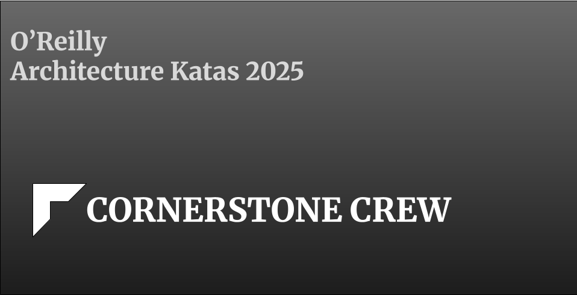
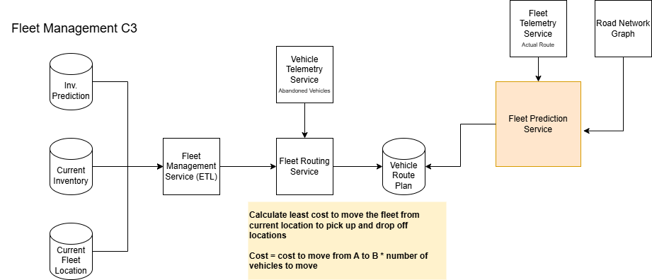

## Table of Contents
- [Overview](#overview)
  - [Team](#team)
- [Problem definition](#problem-definition)
  - [About MobilityCorp](#about-mobilitycorp)
  - [Challenges](#challenges)
  - [High Level Functional Requirements](#high-level-requirements)
- [Solution](#solution)
  - [Architecture characteristics](#architecture-characteristics)
  - [Vehicle Rental Flow](#vehicle-rental-flow)
  - [Architecture Diagram](#architecture-diagram)
  - [AI Components](#ai-components)
    - [Context](#context)
    - [Pricing Model and Fleet Allocation Model](#pricing-model-and-fleet-allocation-model)
    - [Customer Segmentation](#customer-segmentation)
    - [Agentic Chatbots for Customer Service and Internal Work](#agentic-chatbots-for-customer-service-and-internal-work)

## Overview
## Team
* [Christina Zhong](https://www.linkedin.com/in/zhongchristina/)
* [Pavan Baruri](https://www.linkedin.com/in/pavan-baruri/)
* [Jeremy Bierly](https://www.linkedin.com/in/jeremybierly/)
* [Dave Kanter](https://www.linkedin.com/in/kanter/)
* [Chaitanya Addanki](https://www.linkedin.com/in/chaitanya-addanki/)

## Problem definition
### About MobilityCorp
MobilityCorp is a one stop last mile eco friendly transport rental company operating in Europe. They rent out E-Bikes, E-Scooters, Electric Vans and Cars. Currently operating mostly in cities, they are aiming to expand coverage into suburban areas. While currently successful, MobilityCorp has a big challenge ahead if they want to scale and expand their business. They are unsure of how to manage a potential surge in vehicle and battery inventory, how to manage effectively charge their batteries and make sure the vehicles do not run out of charge during rental and how to minimize loss of vehicles as they look to expand their operations across European cities. They are looking to re-architect their mobile application and backend software to meet these challenges.
### Challenges
| Challenge | Details | Desired Outcome |
|:--------  |:------- |:--------------- |
| Anticipate Need | Right vehicles are not in the right place | <ul> <li>Right vehicle type at right location/time [Inventory Management](diagram/CA-Management-InvMgmt.jpeg) <li>Proactive fleet repositioning [Fleet Allocation Model](#pricing-model-and-fleet-allocation-model) <li>Reduced idle time and wasted resources<ul>|
| Minimize battery outage | Electric vehicles running out of charge | <ul> <li>Predict battery outage and route to nearest charging station / battery swap station to reduce battery outage to 0 [Flow](diagram/CA-Returns-Flow.jpeg) <li>Predict / suggest amount of battery packs fleet needs to carry <li>Predit / suggest battery inventory at service centers<li>Optimize route planning for fleet (battery swap) <li> Optimize service technician problem-solving capabilities [Agentic Chatbots for Customer Service and Internal Work](#agentic-chatbots-for-customer-service-and-internal-work) <li> [Fleet Allocation Model](#pricing-model-and-fleet-allocation-model) <ul>|
| Increase User Base | Customers to use our service more frequently and for daily commutes | <ul> <li>Increase user base by 15% YoY <li>Market right product to right customer segments [Notifications](diagram/CA-Notifications.jpeg) <li> Quality-focused retention (vs. volume acquisition) [Customer Segmentation](#customer-segmentation) <li>Offer competitive pricing to attract new customers and retain existing customers, thereby increasing customer lifetime value (CLV) [Pricing Model](#pricing-model-and-fleet-allocation-model) <li>Offer extended services including search, booking, calendar event management, etc. [Agentic Chatbots for Customer Service and Internal Work](#agentic-chatbots-for-customer-service-and-internal-work)<ul>|

## High Level Functional Requirements
### Booking
* Ability to browse and reserve vehicles
  * Choose pick up and drop off locations
  * Ensure that users drop vehicles off at the selected drop off location
* Cars and Vans can be booked 7 days in advance for specific duration
* Bikes and scooters can be booked 30 mins in advance and no specific duration
* Max duration of booking bikes and scooters booking is 12 hours
* Cars and vans should not be made available for booking if they do not have enough charge
* Ability to pre-authorize credit cards prior to booking
### Payments
* Payment is per minute of rental
* Customers should see the rate of vehicles at booking time
* Vehicles being returned at the incorrect location incur fines
### Tracking
* Ability to track where our vehicles are (GPS tracking)
* Ability to remotely lock and unlock vehicles
* Ability for customer to unlock the booked vehicle via NFC device
* Enforce speed limits
### Returning
* Ability to capture photos as proof of return
* Customers should be shown the return location
* Ability to 'force/prompt' customers to plug cars and vans in upon return
* Ability to collect customer feedback on the rental
### Maintenance
* Ability for staff to know which parking bays to visit to swap battery packs for bikes and scooters
* Ability for staff to be notified to move vehicles to popular spots (anticipate need)
* Ability for customers to swap battery during their rental period for extra charge
### Loss Prevention
* <mark>TODO</mark>
## Non-Functional Requirements
* The system must receive data from vehicles at least every 30 seconds; if a different interval is proposed, the team must explain why it's more appropriate.
* The platform must support multiple languages for user interfaces.
* The platform must support multiple currencies for international payments.
* Each country will start with approximately 5,000 bikes, 5,000 scooters, 200 cars, and 200 vans, with most vehicles concentrated around city centers.
* Service will operate through out EU, we need to plan for scaling up

# Solution
## [Architecture Characteristics](diagram/architecture-characteristics.pdf) 
* **Low Latency**: The system must provide an estimated hourly rate for a rental request within 30 seconds of the user's query.
* **Strong Consistency (or Reservation Lock)**: A single rental request must be matched with exactly one available vehicle. This match must be exclusively held (or locked) for that user for 1 minute, during which time the user can accept or decline the offer.
* **Scalability**: The system must be capable of processing 100 transactions per second (TPS), specifically for location updates. It must also be designed to support a 15% growth in this capacity annually for the next five years.</li></ul>

## [Vehicle Rental Flow](diagram/rental_flow.md) 

## Architecture Diagram
* [Architecture Diagram](diagram/mobilitycorp_architecture.pdf)
* [Notifications Architecture](diagram/CA-Katas2025-Notifications-Architecture.png)
  * Batch processing vs Real Time notifications?

## AI Components
### Context
Pre-trained LLMs are trained on general text, primarily publicly available data. They don’t have knowledge of your private context that is not publicly available. You have the option to retrain them with your private context, which can be time-consuming and expensive. They also become outdated quickly once the next versions of the LLMs are released. RAG is a great way to incorporate your context into the context window of LLMs by indexing your content into a vector database. You can also build an AI agent to call your APIs to get access to your information.
#### [AI Overview](solution/ai_overview.md)

### Pricing Model
When MobilityCorp starts, we can build a simple interface to guide the rental flow so that we can build up a customer base and collect data. The data collected in the first three months will be used to train an ML model for price prediction. The pricing model will dynamically calculate prices based on a base rate and any adjustments based on user profile, time of day, day of the week, time of year, etc. 
### Inventory Management Prediction

#### Use of AI in the solution
The inventory management prediction model will be built as an aid to the back office to solve the "Anticipate Need" challenge. This model will help predict what vehicle types, their quantities, locations at which they need to be stationed along with the date and time. 

The model will be trained on booking information (vehicle types, locations, date and time of pick up) and related dimensions like weather and events at the time of pick up and during the duration of the rental. When a return is initiated, this information is pulled and used to train the model. 

To predict future demand, the prediction service will query future booking information, events and weather information and use the model to predict which vehicles need to be located where and when.

#### Algorithm
* Start off with <b>LightGBM</b> to build an MVP
* Switch to <b>TFT</b> once we collect a large amount of data & transition to a feature store like Vertex AI
#### ADR 1
<b>Title: Data Freshness - how frequently to update weather/events data</b>  
<b>Context:</b> We need to decide if we should pull the external data like weather, events information once a day vs more frequently. MobilityCorp's business is highly transactional. They rely on short rental timeframes. While pulling data once a day (or less frequently) will be less costly, updating this data more frequently will improve accuracy vastly.  
<b>Decision:</b> We decided to pull data once an hour and only during the work day (8 - 5). Even though this will incur more costs, the accuracy that this provides will far outweigh the cost benefits of refreshing data once a day. 
#### ADR 2
<b>Title: Streaming vs Batch - how frequently should we push updates to the model</b>  
<b>Context:</b> While batch updating the training data will prove to be cost effective, streaming/near-live updates from booking and returns and weather/events information will enable the business to pivot quickly.  
<b>Decision:</b> Given the fast turnaround times between pick ups and returns, we felt the need to use streaming data to be a non negotiable factor in this architecture. The booking and return service will be set up to push events to a queue to be consumed by the inventory management model  

### Fleet Management Model

#### Use of AI in the solution
Fleet is the vehicles that MobilityCorp uses to move their rental vehicles and batteries around to pick up locations. The Fleet Management Model will be trained on fleet's predicted and actual routes to predict fleet routes and which service centers to move the fleet to based on inventory forecast and past fleet routes taken. The model will also consider abandoned vehicles data to indicate to the driver to pick up any vehicles that have been left at non drop off spots due to malfunction, battery outage etc. 
#### ADR 1
<b>Title: Optimization and Prediction vs just optimization</b>  
<b>Context:</b> Should we only provide route optimization based on demand and fleet availability or should the system be able to predict routes? While route optimization is a first step, this doesn't offer the added value that comes with prediction that enables the company to move fleet vehicles to locations and preplan routes for future  
<b>Decision:</b> We decided to include both optimization and route prediction with the model. The added value of prediction means that the company can run much leaner and do not need to invest in human schedulers to plan routes. One thing we decided not to include is dynamic route planning based on predicted traffic patterns. We are assuming that any traffic patterns will be reoccurring and that these will be accounted for in the current model's "acutal route" parameters that are being fed into it.
### Customer Segmentation

### Agentic Chatbots for Customer Service and Internal Work
As we continue to accumulate data from our business, we can implement chatbots for internal and external users. The internal chatbot helps our employees with onboarding and learning our business. The external chatbot can be part of customer service to help answer users' questions and guide them through the rental journey. These chatbots will be agents that have access to both the vector database of our context and other public APIs to enhance the user journey. For instance, once a user asks a question, the agent can search Google to get information, call our pricing API to get a price estimation for a rental, and call the Google Calendar API to add the booking as an event in the user's calendar.

