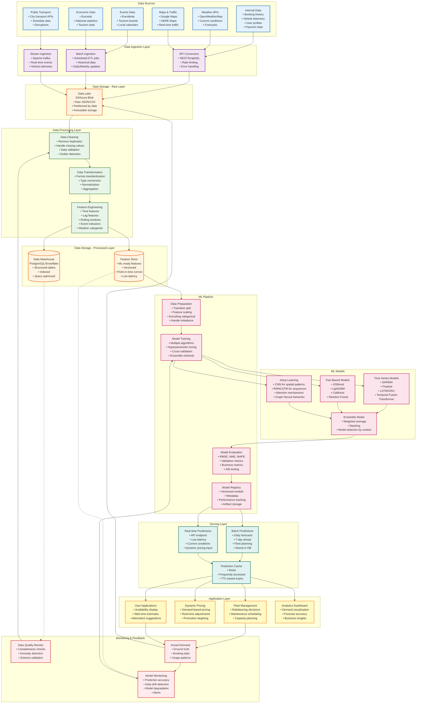

```mermaid
graph TB
    subgraph "Data Sources"
        Internal[Internal Data<br/>• Booking history<br/>• Vehicle telemetry<br/>• User profiles<br/>• Payment data]
        Weather[Weather APIs<br/>• OpenWeatherMap<br/>• Current conditions<br/>• Forecasts]
        Maps[Maps & Traffic<br/>• Google Maps<br/>• HERE Maps<br/>• Real-time traffic]
        Events[Events Data<br/>• Eventbrite<br/>• Tourism boards<br/>• Local calendars]
        Economic[Economic Data<br/>• Eurostat<br/>• National statistics<br/>• Tourism stats]
        Transport[Public Transport<br/>• City transport APIs<br/>• Schedule data<br/>• Disruptions]
    end
    
    subgraph "Data Ingestion Layer"
        BatchIngestion[Batch Ingestion<br/>• Scheduled ETL jobs<br/>• Historical data<br/>• Daily/Weekly updates]
        StreamIngestion[Stream Ingestion<br/>• Apache Kafka<br/>• Real-time events<br/>• Vehicle telemetry]
        APIConnectors[API Connectors<br/>• REST/GraphQL<br/>• Rate limiting<br/>• Error handling]
    end
    
    subgraph "Data Storage - Raw Layer"
        DataLake[Data Lake<br/>S3/Azure Blob<br/>• Raw JSON/CSV<br/>• Partitioned by date<br/>• Immutable storage]
    end
    
    subgraph "Data Processing Layer"
        DataCleaning[Data Cleaning<br/>• Remove duplicates<br/>• Handle missing values<br/>• Data validation<br/>• Outlier detection]
        DataTransform[Data Transformation<br/>• Format standardization<br/>• Type conversion<br/>• Normalization<br/>• Aggregation]
        FeatureEngineering[Feature Engineering<br/>• Time features<br/>• Lag features<br/>• Rolling windows<br/>• Event indicators<br/>• Weather categories]
    end
    
    subgraph "Data Storage - Processed Layer"
        DataWarehouse[(Data Warehouse<br/>PostgreSQL/Snowflake<br/>• Structured tables<br/>• Indexed<br/>• Query optimized)]
        FeatureStore[(Feature Store<br/>• ML-ready features<br/>• Versioned<br/>• Point-in-time correct<br/>• Low latency)]
    end
    
    subgraph "ML Pipeline"
        DataPrep[Data Preparation<br/>• Train/test split<br/>• Feature scaling<br/>• Encoding categorical<br/>• Handle imbalance]
        ModelTraining[Model Training<br/>• Multiple algorithms<br/>• Hyperparameter tuning<br/>• Cross-validation<br/>• Ensemble methods]
        ModelEval[Model Evaluation<br/>• RMSE, MAE, MAPE<br/>• Validation metrics<br/>• Business metrics<br/>• A/B testing]
        ModelRegistry[Model Registry<br/>• Versioned models<br/>• Metadata<br/>• Performance tracking<br/>• Artifact storage]
    end
    
    subgraph "ML Models"
        TimeSeriesModels[Time Series Models<br/>• SARIMA<br/>• Prophet<br/>• LSTM/GRU<br/>• Temporal Fusion Transformer]
        TreeModels[Tree-Based Models<br/>• XGBoost<br/>• LightGBM<br/>• CatBoost<br/>• Random Forest]
        DeepLearning[Deep Learning<br/>• CNN for spatial patterns<br/>• RNN/LSTM for sequences<br/>• Attention mechanisms<br/>• Graph Neural Networks]
        Ensemble[Ensemble Model<br/>• Weighted average<br/>• Stacking<br/>• Model selection by context]
    end
    
    subgraph "Serving Layer"
        BatchPrediction[Batch Predictions<br/>• Daily forecasts<br/>• 7-day ahead<br/>• Fleet planning<br/>• Stored in DB]
        RealtimePrediction[Real-time Predictions<br/>• API endpoint<br/>• Low latency<br/>• Current conditions<br/>• Dynamic pricing input]
        PredictionCache[Prediction Cache<br/>• Redis<br/>• Frequently accessed<br/>• TTL-based expiry]
    end
    
    subgraph "Application Layer"
        FleetManagement[Fleet Management<br/>• Rebalancing decisions<br/>• Maintenance scheduling<br/>• Capacity planning]
        DynamicPricing[Dynamic Pricing<br/>• Demand-based pricing<br/>• Real-time adjustments<br/>• Promotion targeting]
        UserApp[User Applications<br/>• Availability display<br/>• Wait time estimates<br/>• Alternative suggestions]
        Analytics[Analytics Dashboard<br/>• Demand visualization<br/>• Forecast accuracy<br/>• Business insights]
    end
    
    subgraph "Monitoring & Feedback"
        ModelMonitor[Model Monitoring<br/>• Prediction accuracy<br/>• Data drift detection<br/>• Model degradation<br/>• Alerts]
        DataQuality[Data Quality Monitor<br/>• Completeness checks<br/>• Anomaly detection<br/>• Schema validation]
        ActualDemand[Actual Demand<br/>• Ground truth<br/>• Booking data<br/>• Usage patterns]
    end
    
    %% Data flow connections
    Internal --> APIConnectors
    Weather --> APIConnectors
    Maps --> APIConnectors
    Events --> BatchIngestion
    Economic --> BatchIngestion
    Transport --> StreamIngestion
    
    APIConnectors --> DataLake
    BatchIngestion --> DataLake
    StreamIngestion --> DataLake
    
    DataLake --> DataCleaning
    DataCleaning --> DataTransform
    DataTransform --> FeatureEngineering
    
    FeatureEngineering --> DataWarehouse
    FeatureEngineering --> FeatureStore
    
    FeatureStore --> DataPrep
    DataPrep --> ModelTraining
    
    ModelTraining --> TimeSeriesModels
    ModelTraining --> TreeModels
    ModelTraining --> DeepLearning
    
    TimeSeriesModels --> Ensemble
    TreeModels --> Ensemble
    DeepLearning --> Ensemble
    
    Ensemble --> ModelEval
    ModelEval --> ModelRegistry
    
    ModelRegistry --> BatchPrediction
    ModelRegistry --> RealtimePrediction
    
    BatchPrediction --> PredictionCache
    RealtimePrediction --> PredictionCache
    
    PredictionCache --> FleetManagement
    PredictionCache --> DynamicPricing
    PredictionCache --> UserApp
    PredictionCache --> Analytics
    
    FleetManagement --> ActualDemand
    UserApp --> ActualDemand
    ActualDemand --> ModelMonitor
    ActualDemand --> DataLake
    
    ModelMonitor --> ModelTraining
    DataQuality --> DataCleaning
    
    DataWarehouse -.-> DataQuality
    FeatureStore -.-> ModelMonitor
    
    %% Styling
    classDef sources fill:#e3f2fd,stroke:#1565c0,stroke-width:2px
    classDef ingestion fill:#f3e5f5,stroke:#6a1b9a,stroke-width:2px
    classDef storage fill:#fff3e0,stroke:#e65100,stroke-width:2px
    classDef processing fill:#e8f5e9,stroke:#2e7d32,stroke-width:2px
    classDef ml fill:#fce4ec,stroke:#c2185b,stroke-width:2px
    classDef serving fill:#e0f2f1,stroke:#00695c,stroke-width:2px
    classDef app fill:#fff9c4,stroke:#f57f17,stroke-width:2px
    classDef monitor fill:#ffebee,stroke:#c62828,stroke-width:2px
    
    class Internal,Weather,Maps,Events,Economic,Transport sources
    class BatchIngestion,StreamIngestion,APIConnectors ingestion
    class DataLake,DataWarehouse,FeatureStore storage
    class DataCleaning,DataTransform,FeatureEngineering processing
    class DataPrep,ModelTraining,ModelEval,ModelRegistry,TimeSeriesModels,TreeModels,DeepLearning,Ensemble ml
    class BatchPrediction,RealtimePrediction,PredictionCache serving
    class FleetManagement,DynamicPricing,UserApp,Analytics app
    class ModelMonitor,DataQuality,ActualDemand monitor
```
