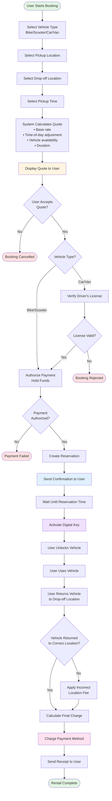

```mermaid
flowchart TD
    Start([User Starts Booking]) --> SelectVehicle[Select Vehicle Type<br/>Bike/Scooter/Car/Van]
    SelectVehicle --> SelectPickup[Select Pickup Location]
    SelectPickup --> SelectDropoff[Select Drop-off Location]
    SelectDropoff --> SelectTime[Select Pickup Time]
    
    SelectTime --> CalcQuote[System Calculates Quote<br/>• Base rate<br/>• Time-of-day adjustment<br/>• Vehicle availability<br/>• Duration]
    
    CalcQuote --> DisplayQuote[Display Quote to User]
    DisplayQuote --> UserDecision{User Accepts<br/>Quote?}
    
    UserDecision -->|No| End1([Booking Cancelled])
    UserDecision -->|Yes| CheckVehicle{Vehicle Type?}
    
    CheckVehicle -->|Bike/Scooter| AuthPayment[Authorize Payment<br/>Hold Funds]
    CheckVehicle -->|Car/Van| VerifyLicense[Verify Driver's License]
    
    VerifyLicense --> LicenseValid{License Valid?}
    LicenseValid -->|No| End2([Booking Rejected])
    LicenseValid -->|Yes| AuthPayment
    
    AuthPayment --> PaymentAuth{Payment<br/>Authorized?}
    PaymentAuth -->|No| End3([Payment Failed])
    PaymentAuth -->|Yes| CreateReservation[Create Reservation]
    
    CreateReservation --> SendConfirmation[Send Confirmation to User]
    SendConfirmation --> WaitTime[Wait Until Reservation Time]
    
    WaitTime --> ActivateKey[Activate Digital Key]
    ActivateKey --> UserUnlock[User Unlocks Vehicle]
    
    UserUnlock --> UseVehicle[User Uses Vehicle]
    UseVehicle --> ReturnVehicle[User Returns Vehicle<br/>to Drop-off Location]
    
    ReturnVehicle --> VerifyReturn{Vehicle Returned<br/>to Correct Location?}
    VerifyReturn -->|No| ApplyFee[Apply Incorrect<br/>Location Fee]
    VerifyReturn -->|Yes| CalcFinal[Calculate Final Charge]
    ApplyFee --> CalcFinal
    
    CalcFinal --> ChargePayment[Charge Payment Method]
    ChargePayment --> SendReceipt[Send Receipt to User]
    SendReceipt --> End4([Rental Complete])
    
    style Start fill:#e1f5e1
    style End1 fill:#ffe1e1
    style End2 fill:#ffe1e1
    style End3 fill:#ffe1e1
    style End4 fill:#e1f5e1
    style DisplayQuote fill:#fff4e1
    style SendConfirmation fill:#e1f0ff
    style ActivateKey fill:#f0e1ff
    style ChargePayment fill:#ffe1f0
```
